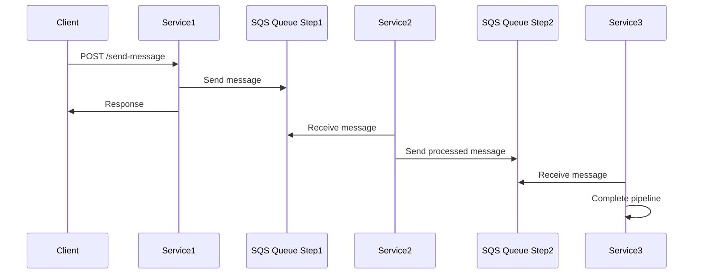
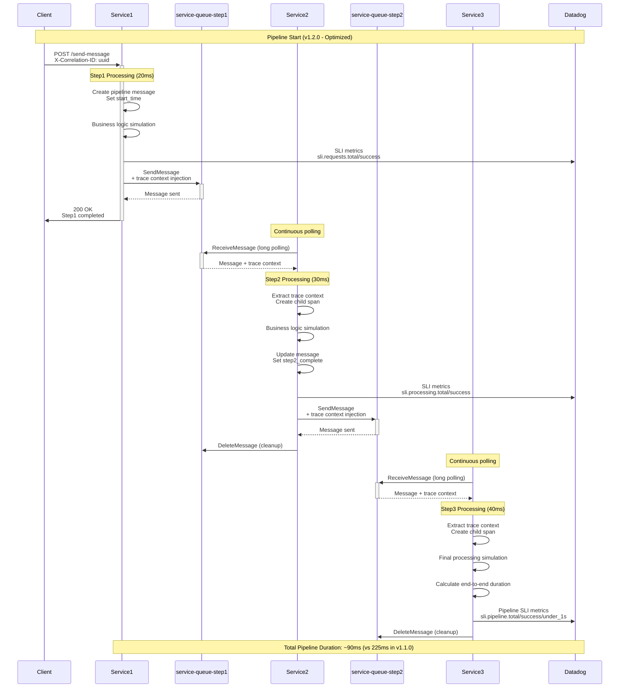

# Multi-Service Pipeline

Demonstrates complex distributed tracing across a 3-service pipeline connected via SQS queues using **Datadog v2** and **Orchestrion**.

## Architecture

### Simple Flow


### Detailed Flow with Tracing


## Services
- **service1**: Entry point, processes HTTP requests
- **service2**: Middle service, processes messages from service1
- **service3**: Final service, processes messages from service2

## Datadog v2 Setup

### Dependencies
This project uses Datadog v2 tracing library:
```go
// Import v2 packages
import (
    httptrace "github.com/DataDog/dd-trace-go/contrib/net/http/v2"
    "github.com/DataDog/dd-trace-go/v2/ddtrace/tracer"
)
```

### Tracer Configuration
```go
// v2 API initialization
tracer.Start(
    tracer.WithService("service-name"),
    tracer.WithEnv("pipeline"),
    tracer.WithServiceVersion("1.1.0"),
)
defer tracer.Stop()
```

### Orchestrion Integration
Orchestration is automatically included via `go.mod`:
```go
require (
    github.com/DataDog/orchestrion v1.5.0
    github.com/DataDog/dd-trace-go/v2 v2.2.3
)
```

## Quick Start
```bash
# Terminal 1: Start Service1
cd service1 && go run main.go

# Terminal 2: Start Service2
cd service2 && go run main.go

# Terminal 3: Start Service3
cd service3 && go run main.go

# Terminal 4: Test
curl -X POST -H "X-Correlation-ID: pipeline-test" http://localhost:8080/process
```

## Queues Required
- `service-queue-step1` (service1 → service2)
- `service-queue-step2` (service2 → service3)

Create with: `../scripts/create-pipeline-queues.sh`

## Key Features
- ✅ **Datadog v2 API**: Latest tracing library
- ✅ **Orchestrion**: Automatic instrumentation
- ✅ **SQS Trace Propagation**: Context preserved across queues
- ✅ **Correlation IDs**: Business-level request tracking
- ✅ **Structured Logging**: JSON logs with trace correlation
- ✅ **SLI Metrics**: Service Level Indicators for SLO monitoring

## SLI Metrics for SLO Monitoring

Each service emits SLI (Service Level Indicator) metrics for Datadog SLO tracking:

### Service 1 (HTTP Entry Point)
- `sli.requests.total` - Total HTTP requests
- `sli.requests.success` - Successful HTTP requests
- `sli.requests.error` - Failed HTTP requests (with error_type tag)
- `sli.response_time` - HTTP response time
- `sli.latency.under_200ms` - Requests completed under 200ms

### Service 2 & 3 (Message Processing)
- `sli.processing.total` - Total messages processed
- `sli.processing.success` - Successfully processed messages
- `sli.processing.error` - Failed message processing (with error_type tag)
- `sli.processing_time` - Message processing time
- `sli.latency.under_150ms` / `sli.latency.under_200ms` - Latency thresholds

### End-to-End Pipeline (Service 3)
- `sli.pipeline.total` - Total pipeline executions
- `sli.pipeline.success` - Successful pipeline completions
- `sli.pipeline.duration` - End-to-end pipeline duration
- `sli.pipeline.under_1s` - Pipelines completed under 1 second

### Example SLO Configurations

**Availability SLO**: 99.9% of requests should be successful
```
SLI: sum(sli.requests.success) / sum(sli.requests.total)
Target: >= 99.9%
```

**Latency SLO**: 95% of requests should complete under 200ms
```
SLI: sum(sli.latency.under_200ms) / sum(sli.requests.total)
Target: >= 95%
```

**Pipeline SLO**: 99% of pipelines should complete under 1 second
```
SLI: sum(sli.pipeline.under_1s) / sum(sli.pipeline.total)
Target: >= 99%
```

## Datadog SLO Configuration

### 1. Pipeline Success SLO (Count-based)

**Measurement Type**: By Count  
**Description**: Measures pipeline completion success rate

**Good Events Query**:
```
sum:sli.pipeline.success{pipeline:multi_service}.as_count()
```

**Total Events Query**:
```
sum:sli.pipeline.total{pipeline:multi_service}.as_count()
```

**Target**: 99.9% over 7 days  
**Name**: Pipeline Success Rate SLO  
**Tags**: `env:pipeline`, `pipeline:multi_service`

### 2. End-to-End Pipeline Duration SLO (Count-based)

**Measurement Type**: By Count  
**Description**: Measures pipeline completion within 1 second

**Good Events Query**:
```
sum:sli.pipeline.under_1s{pipeline:multi_service}.as_count()
```

**Total Events Query**:
```
sum:sli.pipeline.total{pipeline:multi_service}.as_count()
```

**Target**: 99% over 7 days  
**Name**: Pipeline Duration SLO (< 1s)  
**Tags**: `env:pipeline`, `pipeline:multi_service`

### SLO Setup Steps in Datadog

1. **Navigate to SLOs**: Go to Monitors → Service Level Objectives
2. **Create New SLO**: Click "New SLO"
3. **Select Measurement**: Choose "By Count"
4. **Define SLI**: Add Good Events and Total Events queries
5. **Set Target**: Configure percentage and time window
6. **Add Metadata**: Name, description, tags, and teams
7. **Save**: Monitor will appear in SLO dashboard

### Performance Comparison SLOs

With parallel service2 versions, create separate SLOs:

**Service2 Normal (v1.1.0)**:
```
trace.sqs.receive from env:pipeline,service:service2,version:1.1.0 count values <= 0.1 seconds
```

**Service2 Slow (v2.0.0-slow)**:
```
trace.sqs.receive from env:pipeline,service:service2,version:2.0.0-slow count values <= 0.6 seconds
```

This enables direct performance comparison in Datadog SLO dashboards.

## References

### Datadog Documentation
- [DogStatsD for Go](https://docs.datadoghq.com/developers/dogstatsd/?tab=go) - Custom metrics with StatsD client
- [Tagging Best Practices](https://docs.datadoghq.com/getting_started/tagging/) - Effective tagging strategies
- [Custom Instrumentation (Go)](https://docs.datadoghq.com/tracing/trace_collection/custom_instrumentation/go/dd-api/) - Manual tracing with DD API
- [Software Catalog](https://docs.datadoghq.com/internal_developer_portal/software_catalog/#what-appears-in-software-catalog) - Service discovery and metadata
- [Inferred Services Setup](https://docs.datadoghq.com/tracing/services/inferred_services/?tab=agentv7600#set-up-inferred-services) - Configure automatic service discovery
- [Service Level Objectives](https://docs.datadoghq.com/service_management/service_level_objectives/) - Complete SLO documentation
- [SLO Metric Queries](https://docs.datadoghq.com/service_management/service_level_objectives/metric/#define-queries) - Define SLO queries
- [Define and Manage SLOs Blog](https://www.datadoghq.com/blog/define-and-manage-slos/) - Best practices guide