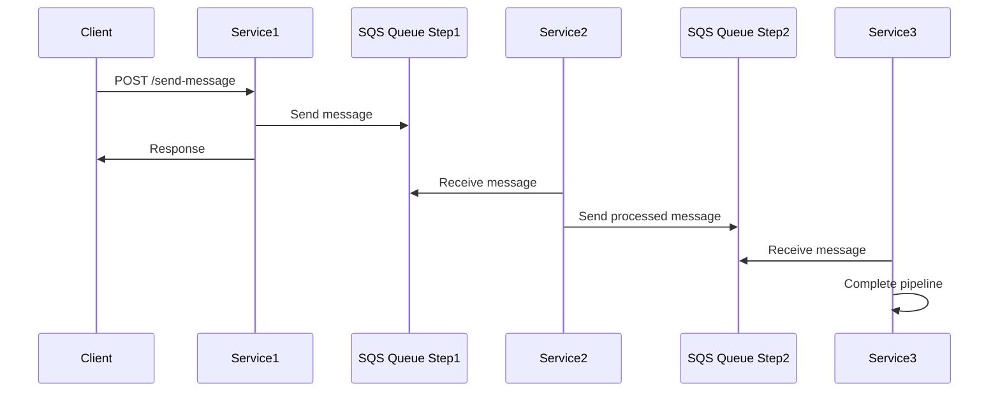
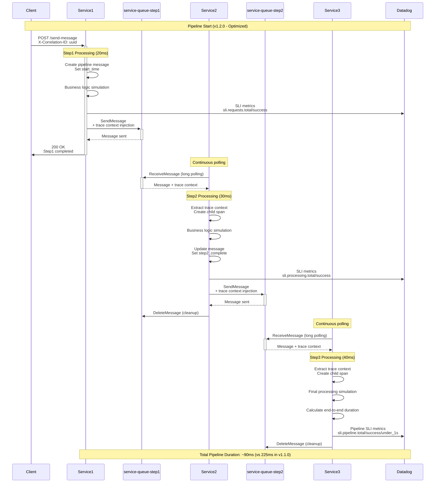

# Multi-Service Pipeline Diagrams

## Simple Flow Diagram

```mermaid
sequenceDiagram
    participant Client
    participant Service1
    participant Queue1 as SQS Queue Step1
    participant Service2
    participant Queue2 as SQS Queue Step2
    participant Service3

    Client->>Service1: POST /send-message
    Service1->>Queue1: Send message
    Service1->>Client: Response
    Service2->>Queue1: Receive message
    Service2->>Queue2: Send processed message
    Service3->>Queue2: Receive message
    Service3->>Service3: Complete pipeline
```

## Detailed Flow Diagram

```mermaid
sequenceDiagram
    participant Client
    participant Service1
    participant Queue1 as service-queue-step1
    participant Service2
    participant Queue2 as service-queue-step2
    participant Service3
    participant Datadog

    Note over Client,Datadog: Pipeline Start (v1.2.0 - Optimized)
    
    Client->>+Service1: POST /send-message<br/>X-Correlation-ID: uuid
    
    Note over Service1: Step1 Processing (20ms)
    Service1->>Service1: Create pipeline message<br/>Set start_time
    Service1->>Service1: Business logic simulation
    Service1->>Datadog: SLI metrics<br/>sli.requests.total/success
    
    Service1->>+Queue1: SendMessage<br/>+ trace context injection
    Queue1-->>-Service1: Message sent
    Service1->>-Client: 200 OK<br/>Step1 completed
    
    Note over Service2: Continuous polling
    Service2->>+Queue1: ReceiveMessage (long polling)
    Queue1-->>-Service2: Message + trace context
    
    Note over Service2: Step2 Processing (30ms)
    Service2->>Service2: Extract trace context<br/>Create child span
    Service2->>Service2: Business logic simulation
    Service2->>Service2: Update message<br/>Set step2_complete
    Service2->>Datadog: SLI metrics<br/>sli.processing.total/success
    
    Service2->>+Queue2: SendMessage<br/>+ trace context injection
    Queue2-->>-Service2: Message sent
    Service2->>Queue1: DeleteMessage (cleanup)
    
    Note over Service3: Continuous polling
    Service3->>+Queue2: ReceiveMessage (long polling)
    Queue2-->>-Service3: Message + trace context
    
    Note over Service3: Step3 Processing (40ms)
    Service3->>Service3: Extract trace context<br/>Create child span
    Service3->>Service3: Final processing simulation
    Service3->>Service3: Calculate end-to-end duration
    Service3->>Datadog: Pipeline SLI metrics<br/>sli.pipeline.total/success/under_1s
    Service3->>Queue2: DeleteMessage (cleanup)
    
    Note over Service1,Datadog: Total Pipeline Duration: ~90ms (vs 225ms in v1.1.0)
```